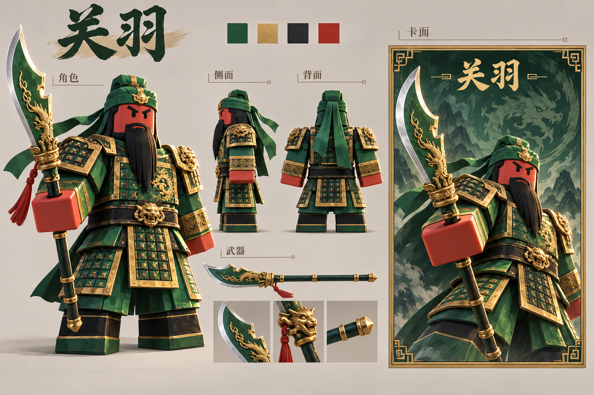

# 关羽美术基准 v1

状态：用户已认可该美术方向（“挺好！我很满意！”）；不是已导入的模型或游戏截图。补齐卡面文字的版本见 [关羽 v2 与赵云 v1](generals-text-and-zhao-yun.md)。

概念图：`assets/art-design/guan-yu-style-sheet-v1.png`（1536 × 1024）。



生成后检查：赤面、绿巾、黑髯、大刀及卡面身份基本统一，完整角色、侧面、背面与武器细节均可见。甲片纹样和金色浮雕仍偏密；后续建模需减少细纹、收敛到大甲片和主要装饰。该图属于视觉方向稿，尚未验证游戏模型的穿插、关节活动或实际性能。

## 本 session 的工作范围

专注 Roblox 三国杀的美术：武将与装备造型、卡面插画和边框、场景与特效的视觉风格。沿用已确定的角色移动、活动边界、攻击射程和公开信息交互；本轮交付用于统一美术方向。

先用关羽建立可复用的基准，再扩展曹操、孙权、赵云。每名武将需要角色、武器、头像与卡面共用同一套身份特征。概念图通过后才据此制作和调整游戏模型。

## 关羽不可丢失的特征

- 赤面、黑色长髯、青绿头巾、绿袍和青龙偃月刀。
- Roblox R6 的方头、宽躯干、块状四肢。服装包在可活动的身体上。
- 把长髯收敛成三个大块面；金色装饰集中在头巾扣、甲缘、腰扣和刀颈。
- 肩甲不横跨关节，腰甲分片并给双腿留间隙；第三人称背面也必须有明确轮廓。
- 大刀保留醒目的宽刃和龙首刀颈；握柄位置清楚，缩小时仍能识别。

## 统一的视觉语言

主体用大块青绿和深色衬底，古金用于结构边缘，朱红用于脸和少量系绳。材质以干净、略带倒角的玩具塑料为主，金属仅作为小面积对比。优先轮廓、明暗层次与颜色分区，随后再补纹样和磨损。

卡面可以使用更有张力的构图、光照和动作，但脸、甲片、头巾和武器不得换一套设计。卡框使用阶梯式几何边角，后续文字与规则信息通过确定性排版制作，不直接依赖生成图中的文字。

活动边界、射程、目标与结算效果沿用交互设计中的含义；装饰性粒子不能遮住手牌、体力和响应提示。

## 评审检查

1. 小尺寸仍能认出关羽，背面也与其他武将不同。
2. 正、侧、背和卡面造型一致。
3. 肩、髋和手腕附近有运动空间，武器可实际握持。
4. 概念图中的细节能转化为可制作的模型与纹理。
5. 图中的文字仅用于概念示意，正式卡牌另行排版。

## 生成记录

方式：内置 image_gen；新图生成，既有主视觉仅作为身份与配色参考。

参考：`assets/key-visual.png`。

提示词摘要（原文件未正确保存完整提示词；本轮后续版本的完整提示词已单独保存）：

```text
Use case: stylized-concept. A landscape Roblox R6 Guan Yu concept sheet using the existing key visual only for character identity. Warm neutral studio background. Large full-body three-quarter character on the left, matching side and back views and glaive study in the middle, matching dynamic portrait card with antique-gold stepped corners on the right. Red face, green headdress, long angular black beard, emerald armor, gold trim, green dragon crescent glaive. Block limbs and clear shoulder/hip movement space. Polished stylized toy materials, consistent costume across every view. Chinese title 关羽; section labels 角色, 武器, 卡面. The first card concept has the name only, no skill text or stats. No commercial card composition copying, realistic human anatomy, logos or watermarks.
```
